# **一、游戏机制概述**

## 1.1. **游戏基本定位**

​	《地牢物语》（英文名为Dungeon Story) 是一款像素风轻量级RPG手游，游戏专注于玩法的创新，采用创新式的半回合制战斗机制，旨在使得古老而经典的回合制游戏在这样一个游戏产业高速更迭的时代重新焕发出其固有的魅力。

## 1.2. **游戏玩法基本设定**

​	玩家在游戏中扮演一位深入地牢进行探险的英雄，玩家操控英雄在地牢中探险、打怪、获得道具、不断提升英雄的实力最终打败地牢的最终Boss从而获得最终的胜利。值得一提的是游戏并未采用RPG游戏惯用的等级系统而是采用物品系统对其进行替代，这样做的好处是使得玩家能够更加直观地感受到游戏中英雄能力的提升。玩家在游戏中主要就是通过搭配道具并巧妙地利用道具与游戏机制地关系来达到角色利益地最大化，这也就是这个游戏的核心玩法所在。

 

# 二、 **游戏人物机制概述**

## **2.1游戏人物机制概述**

游戏中的角色总共分成两类，英雄和怪物，玩家开始游戏时会选择一个英雄作为自己控制的角色进行游戏，英雄共分成4个职业（随着游戏的不断迭代还会加入新的职业）：战士，法师，游侠，盗贼，这四个职业各有各的特点，玩家可以根据个人游戏的喜好进行选择。游戏中的所有的怪物也是各有各的特性，玩家在游戏的过程中常常也需要摸清不同怪物特性的不同来制定不同战斗策略。

游戏中的所有角色都有6个属性(由creature组件管理）：HP（体力值），AT（战斗力），DF（防御力），SP（速度），MG（魔力值），LK（幸运值），而英雄身上会有一些额外的属性如携带的金币数，钥匙数等，这里不再赘述。

游戏的人物的HP，AT，DF，MG都很好理解，SP属性是应用于游戏战斗系统的闪避机制中，而LK值则决定了游戏中人物出招的可能性大小。

## **2.2游戏人物管理机制**

游戏人物的设计与在游戏中的装载全都使用的原型机制，即提前将各个人物制成完整的模型再加载到游戏中，而人物原型的构建是使用组件机制的，即每一个人物都是由一个个组件组装起来的。当游戏人物的原型制作完成后会由游戏的实体管理器（Object Manager)加入到场景中。

 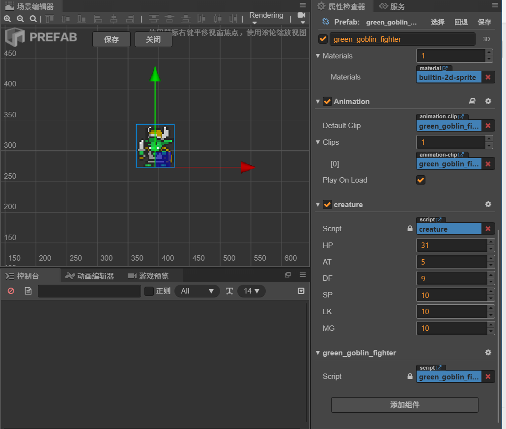

图2-1：哥布林战士人物原型的设计

# 三、 **游戏世界机制概述**

## **3.1游戏世界设计概述**

游戏中玩家深入地牢进行探险，整个地牢共分成4层，玩家层层深入，每一层相当于一个大关卡，通过一层即进入下一层，而每一层地牢中又有9个房间供玩家进行探索。

  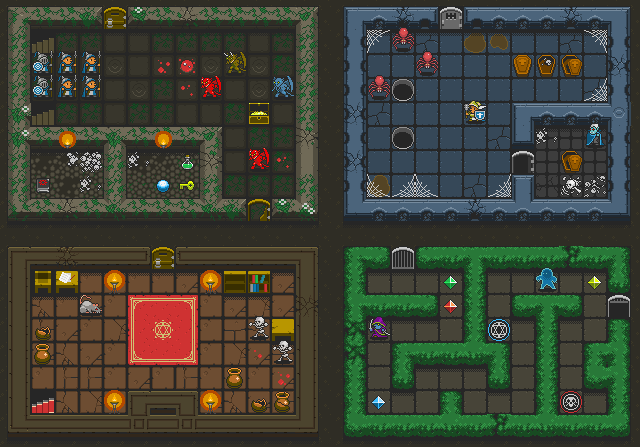

图3-1：游戏世界设计概念图

 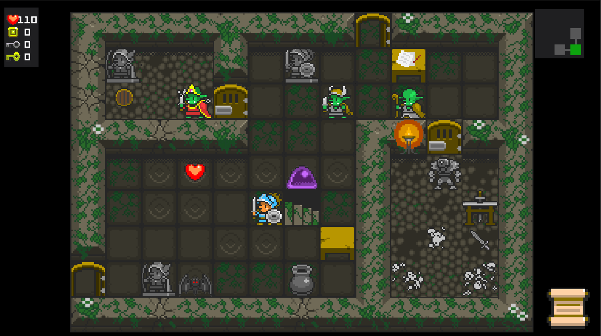

图3-2：游戏世界实际实现图 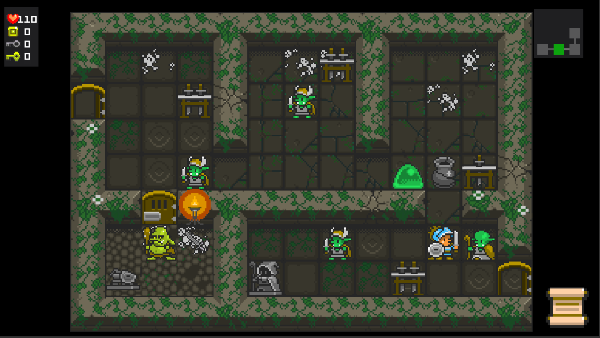

图3-3：游戏世界实际实现图

 

## **3.2游戏世界生成机制**

游戏中的所有地牢都是随机生成的，使用的是改编的随机Prim算法，当进入游戏后，游戏先会生成地牢的基本地形（即墙壁布局）然后根据当前选定的地牢样式进行渲染生成最终的地牢房间的外观，然后游戏会向房间中添加装饰物（如火炬，桌子，雕塑等）,最后再向房间中添加人物，物品等，这些都是按照一定规划随机进行的的。

 

# 四、 **游戏战斗机制概述**

 本游戏最大的亮点就是在其战斗系统的新颖上，游戏的战斗系统是回合制的，但是这个回合制并不是无聊的“你打一下，我打一下”，而是采用的比较刺激的摇摇机（也称为“老虎机”）机制。

 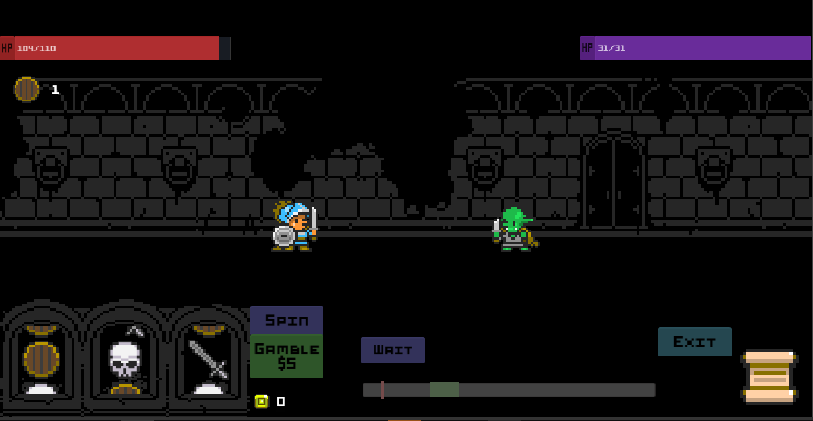

图4-1：游戏战斗场景（左下角即为摇摇机）

玩家通过摇动摇摇机来决定战斗的过程，摇摇机中的选项，以及各个选项概率都取决于玩家装备的道具的搭配。例如图4-1中，当玩家摇到一个宝剑时就会发挥这个这个宝剑的功能（即攻击对方），如果摇到盾牌时则会给玩家增加一个盾牌buff使其免疫下一次收到的伤害，如果玩家还有装备其他的道具也有会在这个摇摇机中出现。如果玩家摇骷髅，则进入敌军的攻击阶段。

但是为了增加游戏的灵活性，在敌军攻击之前游戏的闪避机制即会开启，图4-1中的摇摇机的右边的“闪避条”中的红色游标就会开始以一定的速度移动，玩家通过按动停止按钮尽力使得红色的游标落到闪避条中的绿色的部分，如果操作成功则英雄既可以躲避掉此次攻击，否则敌军攻击成功。

除此之外在游戏还设有一个赌注机制即玩家在摇动摇摇机之前可以对此次结果花钱进行下注使得下一次摇出的结果的效果翻倍，这个也是供玩家利用的一个很重要的玩法。同时当玩家摇出第一个图标之后如果发现结果对自己不利可以花一定金币进行重摇（但是摇动次数有限制），这也是玩家的一个可以利用的机制。

# 五、 **游戏物品机制概述**

## **5.1物品体系设计**

游戏中的物品主要分两大类：消耗品和道具。

消耗品就是一些及时性的物品，英雄拾取后当即发挥效果，这类物品有血瓶，金币，钥匙等。

道具是这个游戏的核心，英雄身上总共有6个道具槽位，多余的道具不能存储在英雄身上，也无法买卖，只能进行替换。

英雄的6个道具槽位有三个是主动道具，这三个槽位没有太大区别，都会出现在战斗系统的摇摇机中供英雄来发动其效果。还有三个就是被动效果槽位，主要是用来的进行属性加成以及增添一些buff的。

 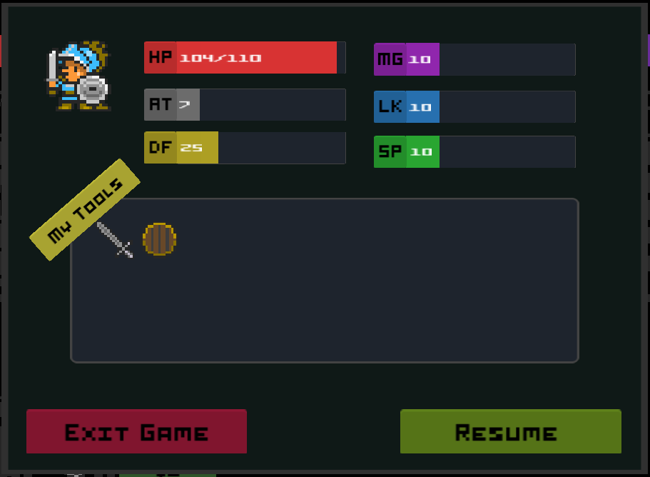

图5-1：游戏英雄的道具池

# 六、 **游戏动画以及特效机制**

## **6.1动画机制**

游戏采用传统的帧动画，每个人物一般都是两帧动画：

 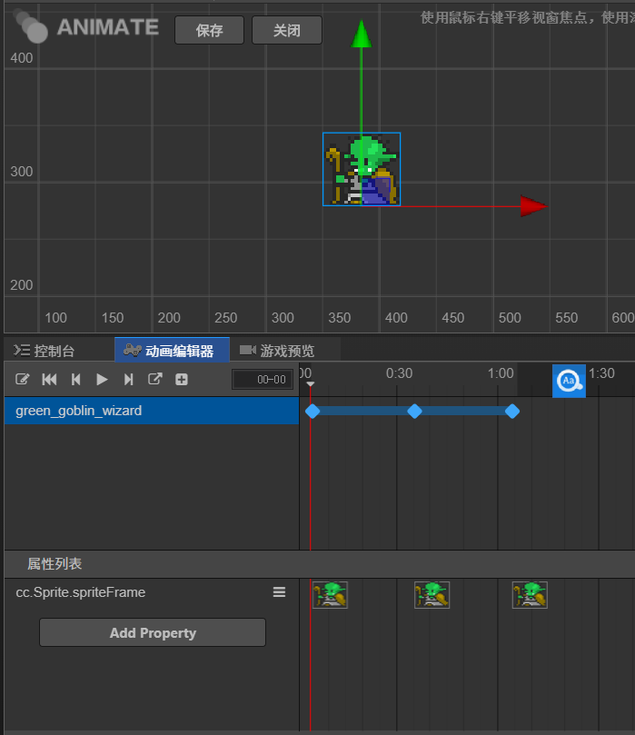

图6-1：游戏人物动画制作

## **6.2特效机制**

游戏中使用的特效一般都是通过将游戏引擎中自带的基础动作搭配特效贴图组合来实现的。

# 七、 **游戏数值系统概述**

## **7.1角色设计**

### **7.1.1角色设计方向**

游戏共有四个职业：战士、猎人、盗贼、巫师

对他们共设有6项基础属性：生命值、攻击力、防御力、技能、幸运、速度。

1项其他属性：金币数额。下表为属性说明：

 

图7-1 角色基础属性

并且将基础属性分为A+，A，B，C四个等级，以不同的组合来突出他们的特点。

 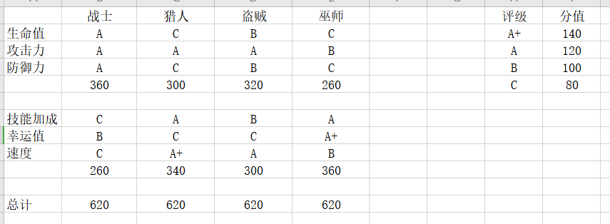

图7-2 角色基础属性等级

根据这个表格，来策划每个职业的具体数值属性。

### **7.1.2角色用到字段**

生命值，防御力，攻击力，技能加成，幸运值，速度。

### **7.1.3生命值初始值及模拟装备加成**

 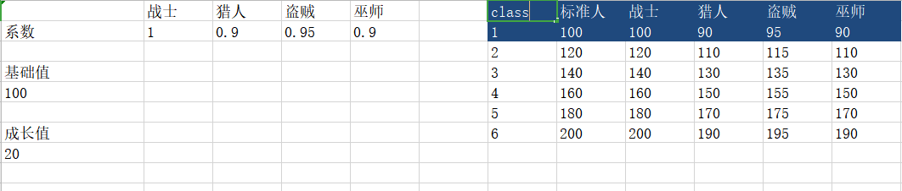

图7-3 生命值与装备加成

等级1为角色初始生命值，之后的为模拟装备加成后的生命值（以下表格也为此设计）

### **7.1.4攻击力初始值及模拟装备加成**

 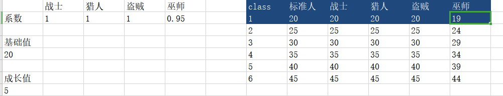

图7-4 攻击力及装备加成

### **7.1.5防御力初始值及模拟装备加成**

 

图7-5 防御力及装备加成

### **7.1.6技能加成初始值及模拟装备加成**

 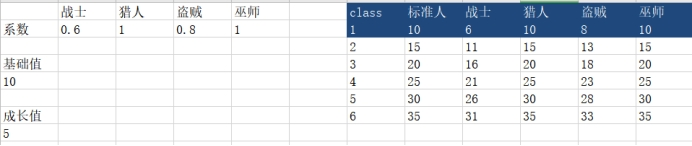

图7-6 技能及装备加成

### **7.1.7幸运初始值及模拟装备加成**

 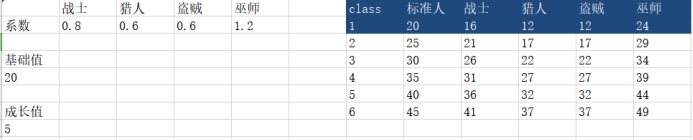

图7-7 幸运值及装备加成

### **7.1.8速度初始值及模拟装备加成**

 

图7-8 速度及装备加成

## **7.2战斗设计**

### **7.2.1战斗流程**

① 根据双方幸运值，进行随机判断是角色还是怪物回合。

②当在角色的回合内，摇到角色攻击时，进行攻击伤害计算；摇到怪物攻击时，根据下方移动条，判断角色是否闪避本次攻击。（移动条的速度快慢受角色与怪物双方的速度影响）

② 当在怪物的回合内，怪物进行攻击或释放技能。

### **7.2.2幸运值影响角色回合公式**

我方回合概率=我方幸运/(我方幸运+敌方幸运)

敌方回合概率=1-我方回合概率

根据双方概率进行随机回合判断

### **7.2.3速度影响角色闪避**

移动条速度公式=0.5+0.5*[我方速度/(我方速度+敌方速度)]

### **7.2.4伤害公式**

攻击=角色攻击+装备攻击+buff增加攻击(面板可见)

技能攻击=攻击*技能伤害系数

伤害=攻击*(1-攻击减免百分比)

攻击减免百分比=k1*[防御/(防御+k2)]

***\*伤害=攻击方攻击\*[1-k\*******\*1\*******\**防御方防御/(防御方防御+k\*******\*2\*******\*)]\****

k1，k2为可变参数

## **7.3怪物设计**

### **7.3.1怪物设计方向**

下表是怪物设定的属性。

 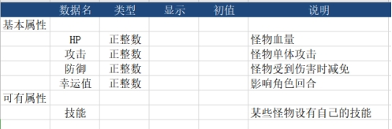

图7-9 怪物属性

怪物的HP、攻击、防御、幸运值四大基础属性都是根据角色对战时所需要的数据而设计出，而技能则属于一些特殊的怪物，使他们更加难以应对，增加玩家对战难度。

### **7.3.2怪物防御HP**

由人物的伤害和预期战斗回合次数来设计怪物的防御与HP

 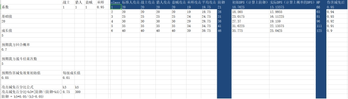

图7-10 怪物防御HP

 

# 八、 **游戏GUI系统概述**

## **8.1控制角色移动**

游戏并未设置按钮摇杆等传统的控制UI，玩家只需要在游戏世界中任意位置进行点击即可移动英雄。

## **8.2查看角色状态**

游戏中设有基础信息提示板，小地图，背包等UI图片如下，点击背包中的物品图标可以查看物品的详细属性。

 

 

 

图8-1：从左到右依次为基础信息提示板，小地图，以及背包按钮

​    

图8-2：打开背包，点击装备图标能够看到装备的详细信息

 

 